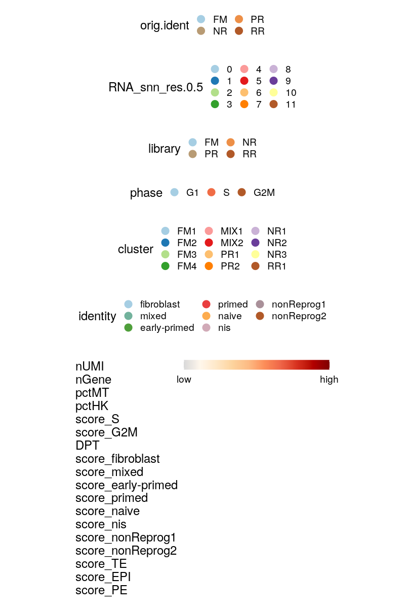
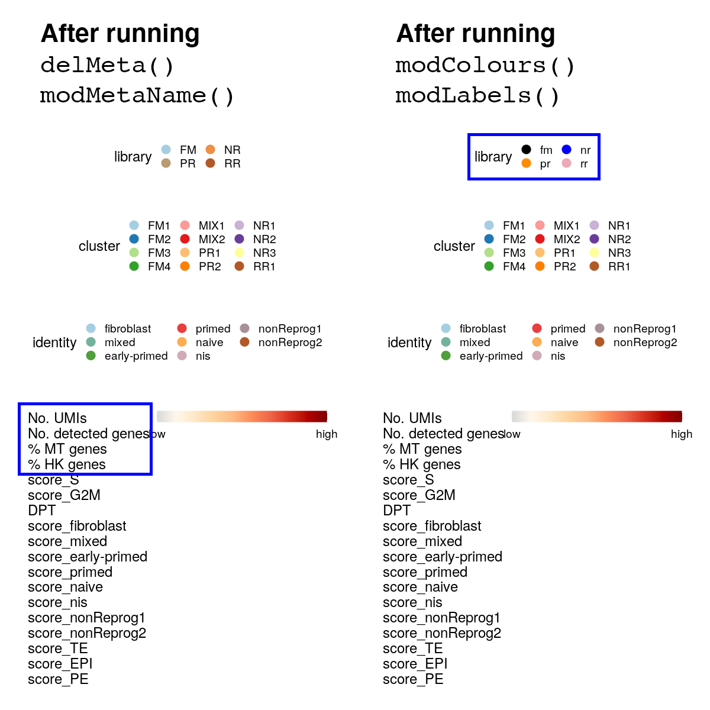
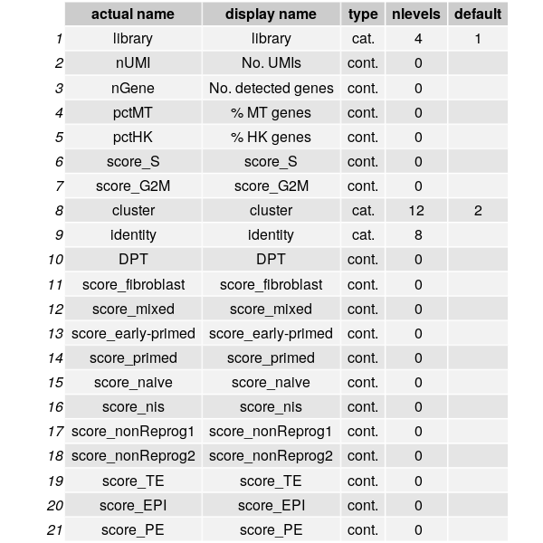
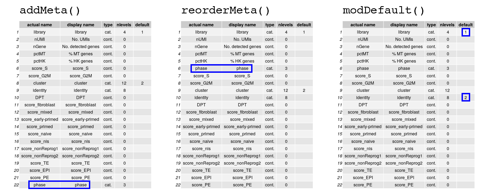
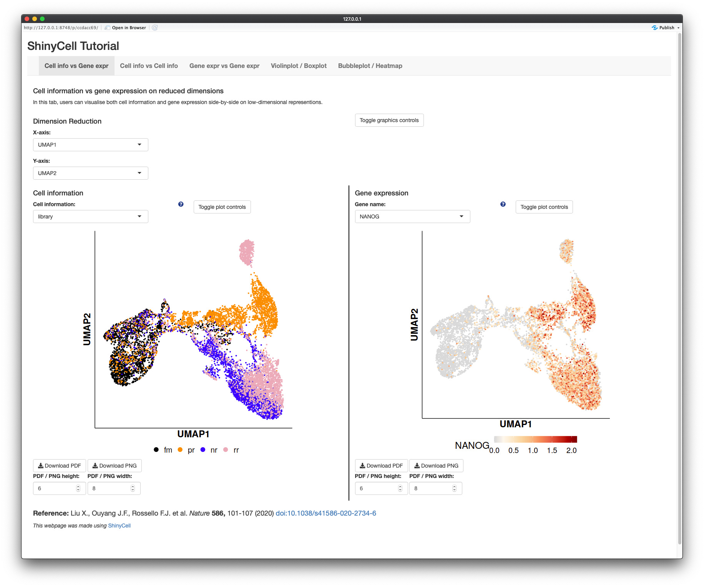
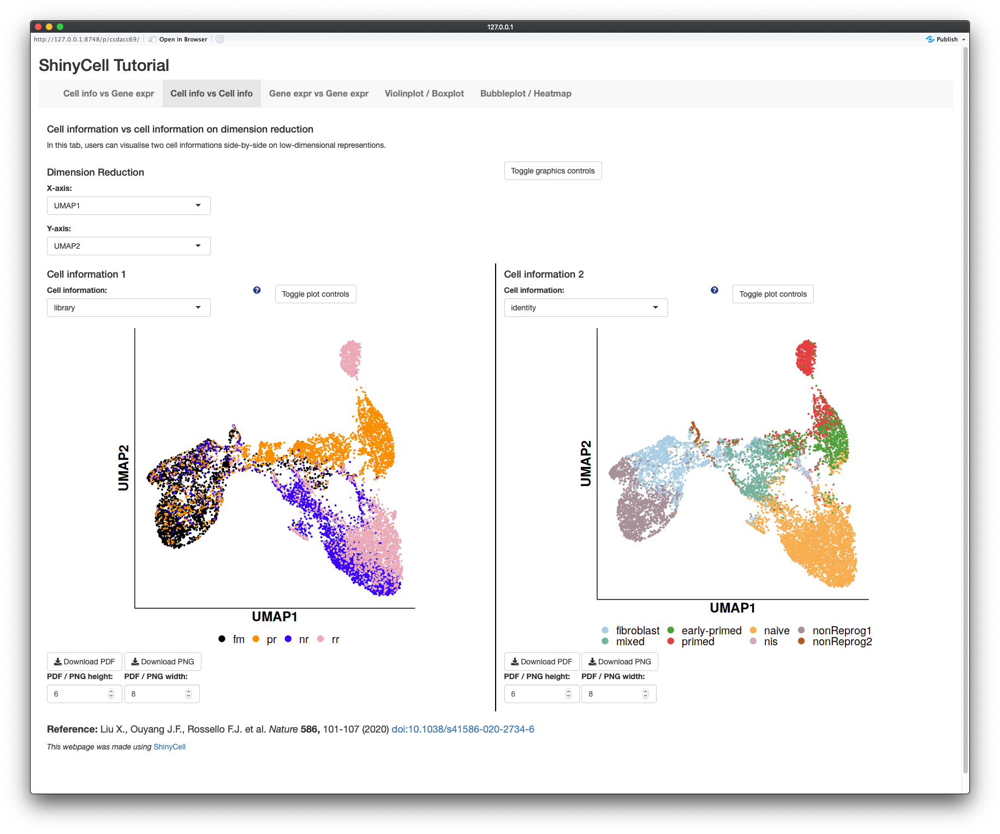
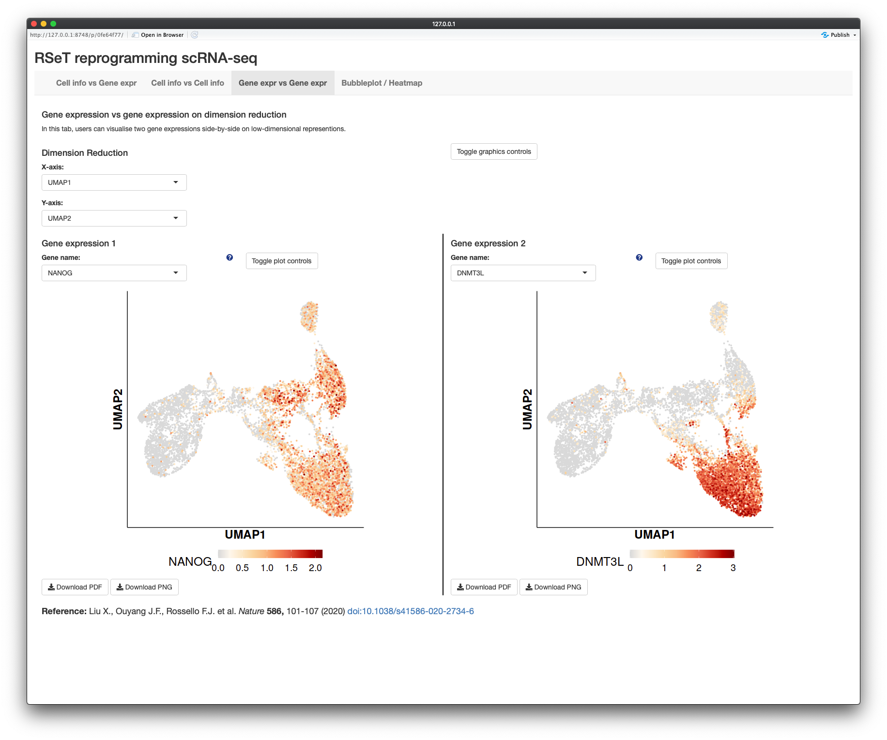
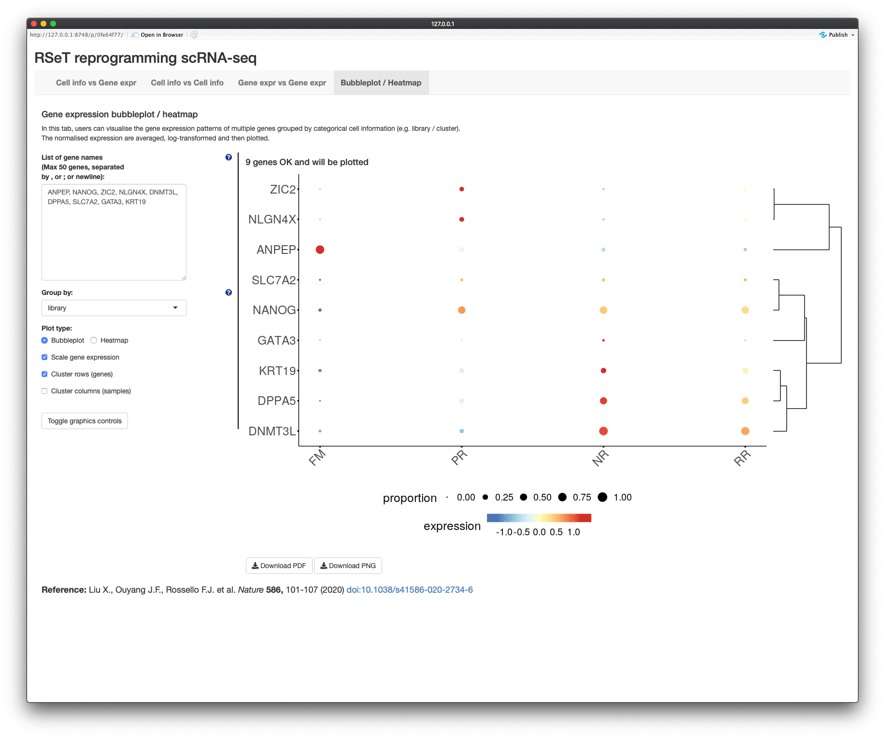
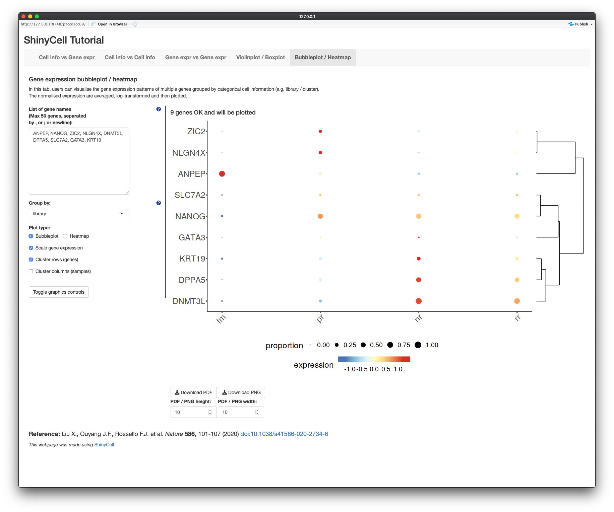

# ShinyCell package
`ShinyCell` is a R package that allows users to create interactive Shiny-based 
web applications to visualise single-cell data via (i) visualising cell 
information and/or gene expression on reduced dimensions e.g. UMAP, (ii) 
visualising the distribution of continuous cell information e.g. nUMI / module 
scores using violin plots / box plots and (iii) visualising the expression of 
multiple genes using bubbleplots / heatmap.

The package supports Seurat objects (v3.0 and above) and SingleCellExperiment 
objects. It is easy to use and customise settings e.g. label names and colour 
palettes. This readme is broken down into the following sections:

- [Installation](#installation) on how to install `ShinyCell`

- [Quick Start Guide](#quick-start-guide) to rapidly deploy a shiny app with 
  a few lines of code

- [Detailed Tutorial](#detailed-tutorial) to customise the shiny app

- [Multi-dataset Tutorial](#multi-dataset-tutorial) to include multiple single-cell 
  datasets into a single shiny app

- [Frequently Asked Questions](#frequently-asked-questions)


# Installation
First, users can run the following code to check if the packages required by 
`ShinyCell` exist and install them if required:
``` r
reqPkg = c("data.table", "Matrix", "hdf5r", "ggplot2", "gridExtra",
           "glue", "readr", "RColorBrewer", "R.utils", "Seurat")
newPkg = reqPkg[!(reqPkg %in% installed.packages()[,"Package"])]
if(length(newPkg)){install.packages(newPkg)}
```

Furthermore, on the system where the Shiny app will be deployed, users can run 
the following code to check if the packages required by the Shiny app exist 
and install them if required:
``` r
reqPkg = c("shiny", "shinyhelper", "data.table", "Matrix", "hdf5r", 
           "ggplot2", "gridExtra", "magrittr", "ggdendro")
newPkg = reqPkg[!(reqPkg %in% installed.packages()[,"Package"])]
if(length(newPkg)){install.packages(newPkg)}
```

`ShinyCell` can then be installed from GitHub as follows:
``` r
devtools::install_github("SGDDNB/ShinyCell")
```


# Quick Start Guide
In short, the `ShinyCell` package takes in an input single-cell object and 
generates a ShinyCell config `scConf` containing labelling and colour palette 
information for the single-cell metadata. The ShinyCell config and single-cell 
object are then used to generate the files and code required for the shiny app. 

In this example, we will use single-cell data (Seurat object) containing 
intermediates collected during the reprogramming of human fibroblast into 
induced pluripotent stem cells using the RSeT media condition, taken from 
[Liu, Ouyang, Rossello et al. Nature (2020)](
https://www.nature.com/articles/s41586-020-2734-6). The Seurat object can be 
[downloaded here](http://files.ddnetbio.com/hrpiFiles/readySeu_rset.rds).

A shiny app can then be quickly generated using the following code:
 
``` r
library(Seurat)
library(ShinyCell)

getExampleData()                       # Download example dataset (~200 MB)
seu = readRDS("readySeu_rset.rds")
scConf = createConfig(seu)
makeShinyApp(seu, scConf, gene.mapping = TRUE,
             shiny.title = "ShinyCell Quick Start") 
```

The generated shiny app can then be found in the `shinyApp/` folder (which is 
the default output folder). To run the app locally, use RStudio to open either 
`server.R` or `ui.R` in the shiny app folder and click on "Run App" in the top 
right corner. The shiny app can also be deployed online via online platforms 
e.g. [shinyapps.io](https://www.shinyapps.io/) or be hosted via Shiny Server.
The shiny app contains five tabs (highlighted in blue box), looking like this:


The first three tabs allows users to visualise single cells on reduced 
dimensions, either showing both cell information and gene expression (first 
tab), showing two cell information side-by-side (second tab) or showing two 
gene expressions side-by-side (third tab). The fourth tab allows users to 
visualise the distribution of continuous cell information e.g. nUMI / module 
scores using a violin plot or box plot and the fifth tab allows users to 
visualise the expression of multiple genes using a bubbleplot or heatmap.


# Detailed Tutorial
Here, we present a detailed walkthrough on how `ShinyCell` can be used to 
create a Shiny app from single-cell data objects, namely Seurat and 
SingleCellExperiment objects. In particular, we will focus on how users can 
customise what metadata is to be included, their labels and colour palettes.

To demonstrate, we will again use single-cell data (Seurat object) containing 
intermediates collected during the reprogramming of human fibroblast into 
induced pluripotent stem cells using the RSeT media condition, taken from 
[Liu, Ouyang, Rossello et al. Nature (2020)](
https://www.nature.com/articles/s41586-020-2734-6). The Seurat object can be 
[downloaded here](http://files.ddnetbio.com/hrpiFiles/readySeu_rset.rds).

First, we will load the Seurat object and run `createConfig()` to create a 
ShinyCell configuration `scConf`. The `scConf` is a data.table containing (i) 
the single-cell metadata to display on the Shiny app, (ii) ordering of factors 
/ categories for categorical metadata e.g. library / cluster and (iii) colour 
palette associated with each metadata. Thus, `scConf` acts as an "instruction 
manual" to build the Shiny app without modifying the original single-cell data.

``` r
library(Seurat)
library(ShinyCell)

# Create ShinyCell config
getExampleData()                       # Download example dataset (~200 MB)
seu <- readRDS("readySeu_rset.rds")
scConf = createConfig(seu)
```

To visualise the contents of the Shiny app prior to building the actual app, 
we can run `showLegend()` to display the legends associated with all the 
single-cell metadata. This allows users to visually inspect which metadata to 
be shown on the Shiny app. This is useful for identifying repetitive metadata 
and checking how factors / categories for categorical metadata will look in 
the eventual Shiny app. Categorical metadata and colour palettes are shown 
first, followed by continuous metadata which are shown collectively. 

``` r
showLegend(scConf)
```



It is possible to modify `scConf` directly but this might be prone to error. 
Thus, we provided numerous convenience functions to modify `scConf` and 
ultimately the Shiny app. In this example, we note that the `orig.ident` and 
`library` as well as `RNA_snn_res.0.5` and `cluster` metadata are similar. To 
exclude metadata from the Shiny app, we can run `delMeta()`. Furthermore, we 
can modify how the names of metadata appear by running `modMetaName()`. In 
this case, we changed the names of some metadata to make them more meaningful. 

By default, colours for categorical metadata are generated by interpolating 
colours from the "Paired" colour palette in the RColorBrewer package. To 
modify the colour palette, we can run `modColours()`. Here, we changed the 
colours for the library metadata to match that in the publication. It is also 
possible to modify the labels for each category via `modLabels()`. For 
example, we changed the labels for the library metadata from upper case to 
lower case. After modifying `scConf`, it is reccomended to run `showLegend()` 
to inspect the changes made.

``` r
# Delete excessive metadata and rename some metadata
scConf = delMeta(scConf, c("orig.ident", "RNA_snn_res.0.5", "phase"))
scConf = modMetaName(scConf, 
                     meta.to.mod = c("nUMI", "nGene", "pctMT", "pctHK"), 
                     new.name = c("No. UMIs", "No. detected genes",
                                  "% MT genes", "% HK genes"))
showLegend(scConf)

# Modify colours and labels
scConf = modColours(scConf, meta.to.mod = "library", 
                    new.colours= c("black", "darkorange", "blue", "pink2"))
scConf = modLabels(scConf, meta.to.mod = "library", 
                   new.labels = c("fm", "pr", "nr", "rr"))
showLegend(scConf)
```



Apart from `showLegend()`, users can also run `showOrder()` to display the 
order in which metadata will appear in the dropdown menu when selecting which 
metadata to plot in the Shiny app. A table will be printed showing the actual 
name of the metadata in the single-cell object and the display name in the 
Shiny app. The metadata type (either categorical or continuous) is also 
provided with the number of categories "nlevels". Finally, the "default" 
column indicates which metadata are the primary and secondary default.

``` r
showOrder(scConf)
```



Here, we introduce a few more functions that might be useful in modifying the 
Shiny app. Users can add metadata back via `addMeta()`. The newly added 
metadata (in this case, the phase metadata) is appended to the bottom of the 
list as shown by `showOrder()`. Next, we can reorder the order in which 
metadata appear in the dropdown menu in the Shiny app via `reorderMeta()`. 
Here, we shifted the phase metadata up the list. Finally, users can change the 
default metadata to plot via `modDefault()`. Again, it is reccomended to run 
`showOrder()` frequently to check how the metadata is changed.

``` r
# Add metadata back, reorder, default
scConf = addMeta(scConf, "phase", seu) 
showOrder(scConf)
scConf = reorderMeta(scConf, scConf$ID[c(1:5,22,6:21)])
showOrder(scConf)
scConf = modDefault(scConf, "library", "identity")
showOrder(scConf)
```



After modifying `scConf` to one's satisfaction, we are almost ready to build 
the Shiny app. Prior to building the Shiny app, users can run `checkConfig()` 
to check if the `scConf` is ready. This is especially useful if users have 
manually modified the `scConf`. Users can also add a footnote to the Shiny app 
and one potential use is to include the reference for the dataset. Here, we 
provide an example of including the citation as the Shiny app footnote.

``` r
# Build shiny app
checkConfig(scConf, seu)
footnote = paste0(
  'strong("Reference: "), "Liu X., Ouyang J.F., Rossello F.J. et al. ",',
  'em("Nature "), strong("586,"), "101-107 (2020) ",',
  'a("doi:10.1038/s41586-020-2734-6",',
  'href = "https://www.nature.com/articles/s41586-020-2734-6",',
  'target="_blank"), style = "font-size: 125%;"'
)
```

Now, we can build the shiny app! A few more things need to be specified here. 
In this example, the Seurat object uses Ensembl IDs and we would like to 
convert them to more user-friendly gene symbols in the Shiny app. `ShinyCell` 
can do this conversion (for human and mouse datasets) conveniently by 
specifying `gene.mapping = TRUE`. If your dataset is already in gene symbols, 
you can leave out this argument to not perform the conversion. Furthermore, 
`ShinyCell` uses the "RNA" assay and "data" slot in Seurat objects as the gene 
expression data. If you have performed any data integration and would like to 
use the integrated data instead, please specify `gex.assay = "integrated`. 
Also, default genes to plot can be specified where `default.gene1` and 
`default.gene2` corresponds to the default genes when plotting gene expression 
on reduced dimensions while `default.multigene` contains the default set of 
multiple genes when plotting bubbleplots or heatmaps. If unspecified, 
`ShinyCell` will automatically select some genes present in the dataset as 
default genes.

``` r
makeShinyApp(seu, scConf, gene.mapping = TRUE, 
             gex.assay = "RNA", gex.slot = "data",
             shiny.title = "ShinyCell Tutorial",
             shiny.dir = "shinyApp/", shiny.footnotes = footnote,
             default.gene1 = "NANOG", default.gene2 = "DNMT3L",
             default.multigene = c("ANPEP","NANOG","ZIC2","NLGN4X","DNMT3L",
                                   "DPPA5","SLC7A2","GATA3","KRT19")) 
```

Under the hood, `makeShinyApp()` does two things: generate (i) the data files 
required for the Shiny app and (ii) the code files, namely `server.R` and 
`ui.R`. The generated files can be found in the `shinyApp/` folder. To run the 
app locally, use RStudio to open either `server.R` or `ui.R` in the shiny app 
folder and click on "Run App" in the top right corner. The shiny app can also 
be deployed via online platforms e.g. [shinyapps.io](https://www.shinyapps.io/) 
or hosted via Shiny Server. The shiny app look like this, containing five tabs. 
Cell information and gene expression are plotted on UMAP in the first tab while 
two different cell information / gene expression are plotted on UMAP in the 
second / third tab respectively. Violin plot or box plot of cell information or 
gene expression distribution can be found in the fourth tab. Lastly, a 
bubbleplot or heatmap can be generated in the fifth tab.

With the Shiny app, users can interactively explore their single-cell data, 
varying the cell information / gene expression to plot. Furthermore, these 
plots can be exported into PDF / PNG for presentations / publications. Users 
can also click on the "Toggle graphics controls" or "Toggle plot controls" to 
fine-tune certain aspects of the plots e.g. point size.








# Multi-dataset Tutorial
Users might want to include multiple single-cell datasets into a single Shiny 
app and `ShinyCell` provides this functionality. We will demonstrate how to 
create a Shiny app containing two single-cell datasets. For the first example 
dataset, we will again use scRNA-seq data (Seurat object) containing 
intermediates collected during the reprogramming of human fibroblast into 
induced pluripotent stem cells using the RSeT media condition, which can be 
[downloaded here](http://files.ddnetbio.com/hrpiFiles/readySeu_rset.rds). For 
the second example dataset, we will use scRNA-seq of day 21 reprogramming 
intermediates from the same publication, which can be 
[downloaded here](http://files.ddnetbio.com/hrpiFiles/readySeu_d21i.rds).
After downloading the data, we will begin by loading the required libraries. 

``` r
library(Seurat)
library(ShinyCell)
getExampleData("multi")      # Download multiple example datasets (~400 MB)
```

To create a multi-dataset Shiny app, we need to configure the settings for 
each dataset separately. We will do so for the first dataset as follows. A 
ShinyCell configuration `scConf1` is created, followed by modifying various 
aspects of the Shiny app e.g. removing excessive metadata, modifying the 
display names of metadata and modifying the colour palettes. For a more 
detailed explanation on how to customise the shiny app, refer to the 
[Detailed Tutorial](#detailed-tutorial). We then run `makeShinyFiles()` to 
generate the files related to the first dataset. Notice that we specified 
`shiny.prefix = "sc1"` and this prefix is used to identify that the files 
contain single-cell data related to the first dataset. The remaining arguments 
are the same as explained in the [Detailed Tutorial](#detailed-tutorial).

``` r
seu <- readRDS("readySeu_rset.rds")
scConf1 = createConfig(seu)
scConf1 = delMeta(scConf1, c("orig.ident", "RNA_snn_res.0.5"))
scConf1 = modMetaName(scConf1, meta.to.mod = c("nUMI", "nGene", "pctMT", "pctHK"), 
                      new.name = c("No. UMIs", "No. detected genes",
                                   "% MT genes", "% HK genes"))
scConf1 = modColours(scConf1, meta.to.mod = "library", 
                     new.colours= c("black", "darkorange", "blue", "pink2"))
makeShinyFiles(seu, scConf1, gex.assay = "RNA", gex.slot = "data",
               gene.mapping = TRUE, shiny.prefix = "sc1",
               shiny.dir = "shinyAppMulti/",
               default.gene1 = "NANOG", default.gene2 = "DNMT3L",
               default.multigene = c("ANPEP","NANOG","ZIC2","NLGN4X","DNMT3L",
                                     "DPPA5","SLC7A2","GATA3","KRT19"),
               default.dimred = c("UMAP_1", "UMAP_2"))
```

We then repeat the same procedure for the second dataset to generate the files 
required for the Shiny app. Notice that we used a different prefix here 
`shiny.prefix = "sc2"`. 

``` r
seu <- readRDS("readySeu_d21i.rds")
scConf2 = createConfig(seu)
scConf2 = delMeta(scConf2, c("orig.ident", "RNA_snn_res.0.5"))
scConf2 = modMetaName(scConf2, meta.to.mod = c("nUMI", "nGene", "pctMT", "pctHK"), 
                      new.name = c("No. UMIs", "No. detected genes",
                                   "% MT genes", "% HK genes"))
scConf2 = modColours(scConf2, meta.to.mod = "library", 
                     new.colours= c("black", "blue", "purple"))
makeShinyFiles(seu, scConf2, gex.assay = "RNA", gex.slot = "data",
               gene.mapping = TRUE, shiny.prefix = "sc2",
               shiny.dir = "shinyAppMulti/",
               default.gene1 = "GATA3", default.gene2 = "DNMT3L",
               default.multigene = c("ANPEP","NANOG","ZIC2","NLGN4X","DNMT3L",
                                     "DPPA5","SLC7A2","GATA3","KRT19"),
               default.dimred = c("UMAP_1", "UMAP_2"))
```

We can the proceed to the final part where we generate the code for the Shiny 
app using the `makeShinyCodesMulti()` function. To specify that two datasets 
will be included in this Shiny app, we input the prefixes of the two datasets 
`shiny.prefix = c("sc1", "sc2")`. Also, users need to specify section headers 
for each dataset via the `shiny.headers` argument. The remaining arguments are 
the same as explained in the [Detailed Tutorial](#detailed-tutorial).

``` r
footnote = paste0(
  'strong("Reference: "), "Liu X., Ouyang J.F., Rossello F.J. et al. ",',
  'em("Nature "), strong("586,"), "101-107 (2020) ",',
  'a("doi:10.1038/s41586-020-2734-6",',
  'href = "https://www.nature.com/articles/s41586-020-2734-6",',
  'target="_blank"), style = "font-size: 125%;"'
)
makeShinyCodesMulti(
  shiny.title = "Multi-dataset Tutorial", shiny.footnotes = footnote,
  shiny.prefix = c("sc1", "sc2"),
  shiny.headers = c("RSeT reprogramming", "Day 21 intermediates"), 
  shiny.dir = "shinyAppMulti/") 
```

Now, we have both the data and code for the Shiny app and we can run the Shiny 
app. Each dataset can be found in their corresponding tabs and clicking on the 
tab creates a dropdown to change the type of plot to display on the Shiny app.
This tutorial can be easily expanded to include three or more datasets. Users 
simply have to create the corresponding data files for each dataset and finally 
generate the code for the Shiny app.


# Frequently Asked Questions
- Q: How much memory / storage space does `ShinyCell` and the Shiny app consume?
  - A: The Shiny app itself consumes very little memory and is meant to be a 
       heavy-duty app where multiple users can access the app simultaneously. 
       Unlike typical R objects, the entire gene expression matrix is stored 
       on disk and *not on memory* via the hdf5 file system. Also, the hdf5 
       file system offers superior file compression and takes up less storage 
       space than native R file formats such as rds / Rdata files.
  - A: It should be noted that a large amount of memory is required when 
       *building* the Shiny app. This is because the whole Seurat / SCE object 
       has to be loaded onto memory and additional memory is required to 
       generate the required files. From experience, a typical laptop with 8GB 
       RAM can handle datasets around 30k cells while 16GB RAM machines can 
       handle around 60k-70k cells. 
       
- Q: I have generated additional dimension reductions (e.g. force-directed 
layout / MDS / monocle2 etc.) and would like to include them into the Shiny 
app. How do I do that?
  - A: `ShinyCell` automatically retrieves dimension reduction information from 
       the Seurat or SCE object. Thus, the additional dimension reductions 
       have to be added into the Seurat or SCE object before running `ShinyCell`. 
  - For Seurat objects, users can refer "Storing a custom dimensional reduction 
       calculation" in https://satijalab.org/seurat/v3.0/dim_reduction_vignette.html
  - For SCE objects, users can refer to https://bioconductor.org/packages/devel/bioc/vignettes/SingleCellExperiment/inst/doc/intro.html#3_Adding_low-dimensional_representations
  
- Q: I have both RNA and integrated data in my Seurat object. How do I specify 
which gene expression assay to plot in the Shiny app?
  - A: Only one gene expression assay can be visualised per dataset. To 
       specify the assay, use the `gex.assay = "integrated` argument in the 
       `makeShinyApp()` or `makeShinyFiles()` functions. If users want to 
       visualise both gene expression, they have to treat each assay as an 
       individual dataset and include multiple datasets into a single shiny 
       app, following the [Multi-dataset Tutorial](#multi-dataset-tutorial)


<br/><br/>
<br/><br/>
<br/><br/>
<br/><br/>
<br/><br/>