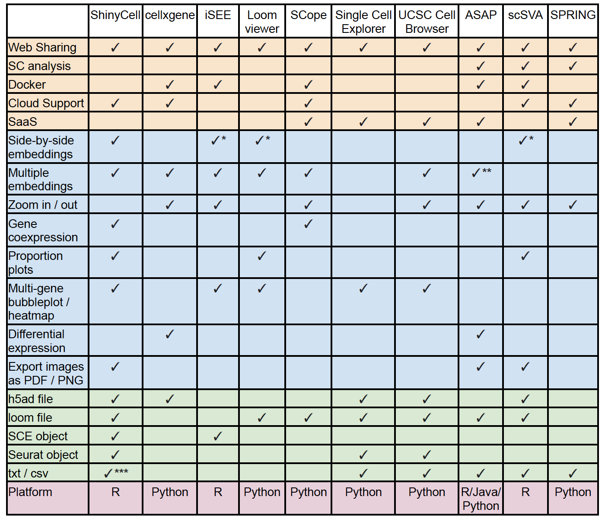
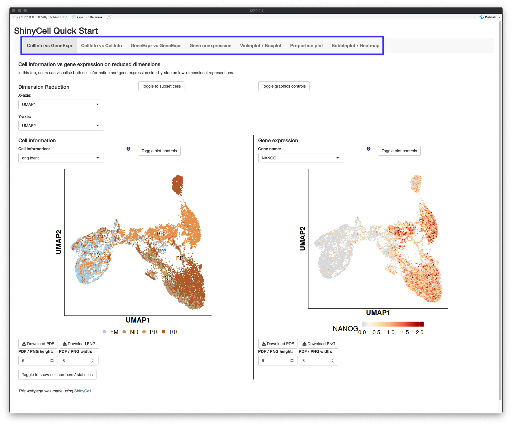
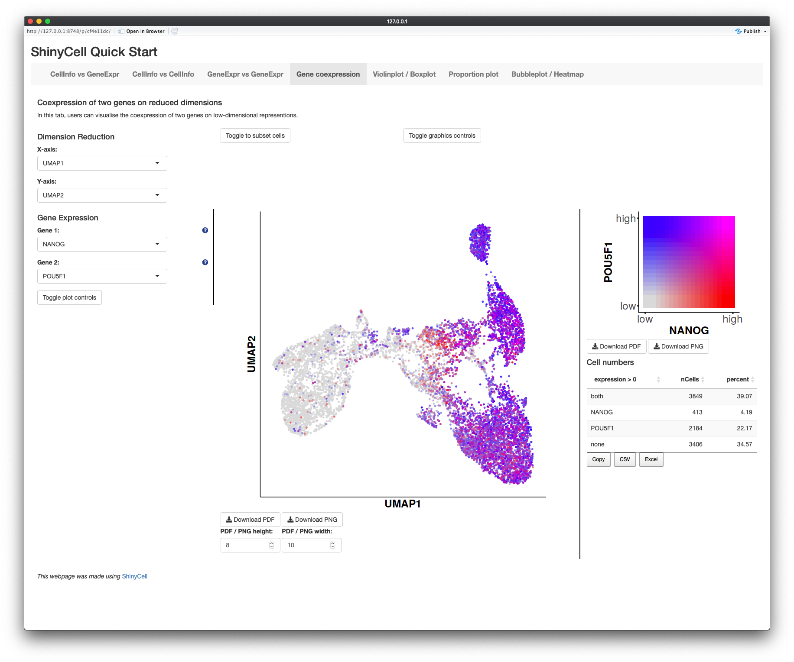
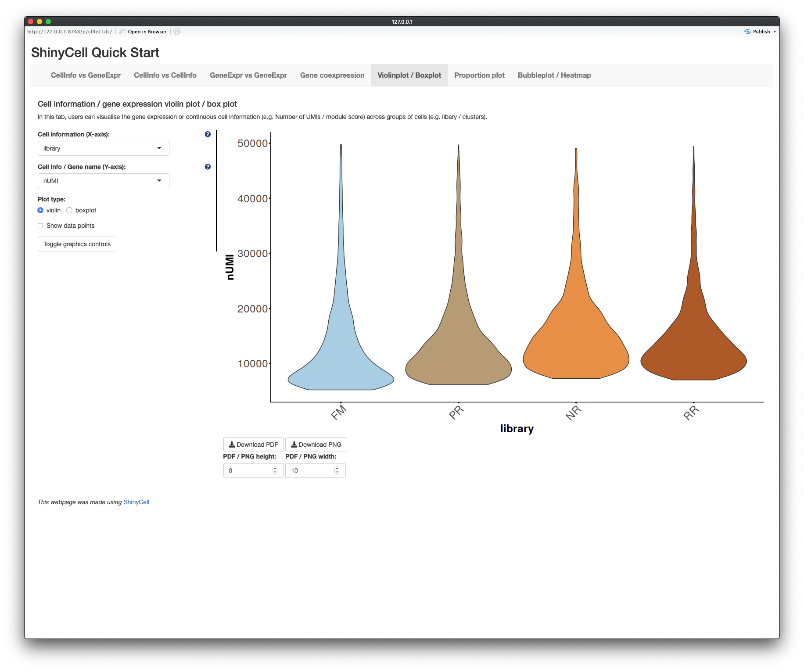
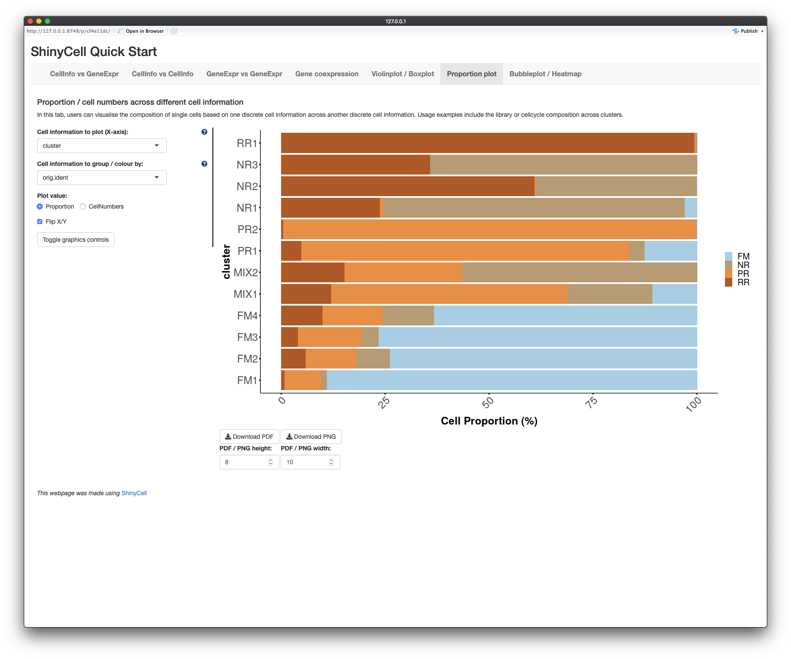
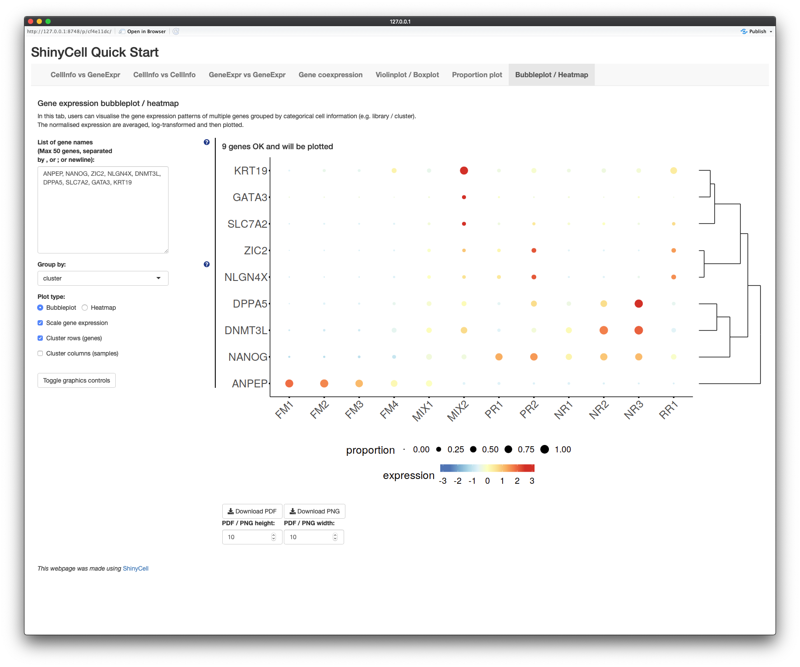

# ShinyCell package
`ShinyCell` is a R package that allows users to create interactive Shiny-based 
web applications to visualise single-cell data via (i) visualising cell 
information and/or gene expression on reduced dimensions e.g. UMAP, (ii) 
visualising the coexpression of two genes on reduced dimensions, (iii) 
visualising the distribution of continuous cell information e.g. nUMI / module 
scores using violin plots / box plots, (iv) visualising the composition of 
different clusters / groups of cells using proportion plots and (v) 
visualising the expression of multiple genes using bubbleplots / heatmap. 
Examples of ShinyCell-generated shiny apps for single and multi datasets can 
be found at http://shinycell1.ddnetbio.com and http://shinycell2.ddnetbio.com 
respectively.

If you are using `ShinyCell`, please cite [Ouyang et al. ShinyCell: Simple and 
sharable visualisation of single-cell gene expression data. Bioinformatics, 
doi:10.1093/bioinformatics/btab209](
http://dx.doi.org/10.1093/bioinformatics/btab209). The manuscript 
is recently accepted and we will update the full citation when it is available.

Key features of `ShinyCell` include: 

1. Written in R and uses the Shiny package, allowing for easy sharing on online 
   platforms e.g. [shinyapps.io](https://www.shinyapps.io/) and Amazon Web 
   Services (AWS) or be hosted via Shiny Server

2. Supports all of the major single-cell data formats (h5ad / loom / Seurat / 
   SingleCellExperiment) and we also include a simple tutorial to process 
   plain-text gene expression matrices
  
3. Web interface have low memory footprint due to the use of hdf5 file system 
   to store the gene expression. Only the expression of genes that are plotted 
   are loaded into memory

4. Inclusion of less common single-cell visualisations, namely coexpression 
   plots and proportion plots that provide additional information on top of 
   low-dimensional embeddings
  
5. Users can export visualisations as PDF or PNG images for presentation or 
   publication use

6. Ability to include multiple single-cell datasets into a single Shiny web app

7. It is easy to use and customise aethetsics e.g. label names and colour 
   palettes. In the simplest form, ShinyCell can convert an input single-cell 
   data into a Shiny app with five lines of code 
   (see [Quick Start Guide](#quick-start-guide))

We also compared ShinyCell with nine other popular scRNA-seq visualisation 
tools, which further highlights the key features of `ShinyCell`. For a more 
detailed description, see the 
[Supplementary Information](docs/OuyangEtAl_Shinycell_SuppInfo.pdf).




# Table of Contents and Additional Tutorials
This readme is broken down into the following sections:

- [Installation](#installation) on how to install `ShinyCell`

- [Quick Start Guide](#quick-start-guide) to rapidly deploy a shiny app with 
  a few lines of code

- [Frequently Asked Questions](#frequently-asked-questions)

There are also additional tutorials as follows:

- [Tutorial for customising ShinyCell aesthetics](
https://htmlpreview.github.io/?https://github.com/SGDDNB/ShinyCell/blob/master/docs/1aesthetics.html)

- [Tutorial for creating a ShinyCell app containing several single-cell datasets](
https://htmlpreview.github.io/?https://github.com/SGDDNB/ShinyCell/blob/master/docs/2multi.html)

- [Tutorial on other supported file formats (h5ad / loom / SCE)](
https://htmlpreview.github.io/?https://github.com/SGDDNB/ShinyCell/blob/master/docs/3otherformat.html)

- [Tutorial on processing plain-text gene expression matrices](
https://htmlpreview.github.io/?https://github.com/SGDDNB/ShinyCell/blob/master/docs/3plaintext.html)

- [Instructions on how to deploy ShinyCell apps online](
https://htmlpreview.github.io/?https://github.com/SGDDNB/ShinyCell/blob/master/docs/4cloud.html)


# Installation
First, users can run the following code to check if the packages required by 
`ShinyCell` exist and install them if required:
``` r
reqPkg = c("data.table", "Matrix", "hdf5r", "reticulate", "ggplot2", 
           "gridExtra", "glue", "readr", "RColorBrewer", "R.utils", "Seurat")
newPkg = reqPkg[!(reqPkg %in% installed.packages()[,"Package"])]
if(length(newPkg)){install.packages(newPkg)}

# If you are using h5ad file as input, run the code below as well
# reticulate::py_install("anndata")
```

Furthermore, on the system where the Shiny app will be deployed, users can run 
the following code to check if the packages required by the Shiny app exist 
and install them if required:
``` r
reqPkg = c("shiny", "shinyhelper", "data.table", "Matrix", "DT", "hdf5r", 
           "reticulate", "ggplot2", "gridExtra", "magrittr", "ggdendro")
newPkg = reqPkg[!(reqPkg %in% installed.packages()[,"Package"])]
if(length(newPkg)){install.packages(newPkg)}
```

`ShinyCell` can then be installed from GitHub as follows:
``` r
devtools::install_github("SGDDNB/ShinyCell")
```


# Quick Start Guide
In short, the `ShinyCell` package takes in an input single-cell object and 
generates a ShinyCell config `scConf` containing labelling and colour palette 
information for the single-cell metadata. The ShinyCell config and single-cell 
object are then used to generate the files and code required for the shiny app. 

In this example, we will use single-cell data (Seurat object) containing 
intermediates collected during the reprogramming of human fibroblast into 
induced pluripotent stem cells using the RSeT media condition, taken from 
[Liu, Ouyang, Rossello et al. Nature (2020)](
https://www.nature.com/articles/s41586-020-2734-6). The Seurat object can be 
[downloaded here](http://files.ddnetbio.com/hrpiFiles/readySeu_rset.rds).

A shiny app can then be quickly generated using the following code:
 
``` r
library(Seurat)
library(ShinyCell)

getExampleData()                       # Download example dataset (~200 MB)
seu = readRDS("readySeu_rset.rds")
scConf = createConfig(seu)
makeShinyApp(seu, scConf, gene.mapping = TRUE,
             shiny.title = "ShinyCell Quick Start") 
```

The generated shiny app can then be found in the `shinyApp/` folder (which is 
the default output folder). To run the app locally, use RStudio to open either 
`server.R` or `ui.R` in the shiny app folder and click on "Run App" in the top 
right corner. The shiny app can also be deployed online via online platforms 
e.g. [shinyapps.io](https://www.shinyapps.io/) and Amazon Web Services (AWS) 
or be hosted via Shiny Server. For further details, refer to 
[Instructions on how to deploy ShinyCell apps online](
https://htmlpreview.github.io/?https://github.com/SGDDNB/ShinyCell/blob/master/docs/4cloud.html).

The shiny app contains seven tabs (highlighted in blue box), with the opening 
page showing the first tab "CellInfo vs GeneExpr" (see below), plotting both 
cell information and gene expression side-by-side on reduced dimensions e.g. 
UMAP. Users can click on the toggle on the bottom left corner to display the 
cell numbers in each cluster / group and the number of cells expressing a gene.
The next two tabs are similar, showing either two cell information 
side-by-side (second tab: "CellInfo vs CellInfo") or two gene expressions 
side-by-side (third tab: "GeneExpr vs GeneExpr").



The fourth tab "Gene coexpression" blends the gene expression of two genes, 
given by two different colour hues, onto the same reduced dimensions plot. 
Furthermore, the number of cells expressing either or both genes are given. 



The fifth tab "Violinplot / Boxplot" plots the distribution of continuous cell 
information e.g. nUMI or module scores or gene expression across each cluster 
/ group using violin plots or box plots.



The sixth tab "Proportion plot" plots the composition of different clusters / 
groups of cells using proportion plots. Users can also plot the cell numbers 
instead of proportions.



The seventh tab "Bubbleplot / Heatmap" allows users to visualise the 
expression of multiple genes across each cluster / group using bubbleplots / 
heatmap. The genes (rows) and groups (columns) can be furthered clustered 
using hierarchical clustering.




# Frequently Asked Questions
- Q: How much memory / storage space does `ShinyCell` and the Shiny app consume?
  - A: The Shiny app itself consumes very little memory and is meant to be a 
       heavy-duty app where multiple users can access the app simultaneously. 
       Unlike typical R objects, the entire gene expression matrix is stored 
       on disk and *not on memory* via the hdf5 file system. Also, the hdf5 
       file system offers superior file compression and takes up less storage 
       space than native R file formats such as rds / Rdata files.
  - A: It should be noted that a large amount of memory is required when 
       *building* the Shiny app. This is because the whole Seurat / SCE object 
       has to be loaded onto memory and additional memory is required to 
       generate the required files. From experience, a typical laptop with 8GB 
       RAM can handle datasets around 30k cells while 16GB RAM machines can 
       handle around 60k-70k cells. 
       
- Q: I have generated additional dimension reductions (e.g. force-directed 
layout / MDS / monocle2 etc.) and would like to include them into the Shiny 
app. How do I do that?
  - A: `ShinyCell` automatically retrieves dimension reduction information from 
       the Seurat or SCE object. Thus, the additional dimension reductions 
       have to be added into the Seurat or SCE object before running `ShinyCell`. 
  - For Seurat objects, users can refer "Storing a custom dimensional reduction 
       calculation" in https://satijalab.org/seurat/v3.0/dim_reduction_vignette.html
  - For SCE objects, users can refer to https://bioconductor.org/packages/devel/bioc/vignettes/SingleCellExperiment/inst/doc/intro.html#3_Adding_low-dimensional_representations
  
- Q: I have both RNA and integrated data in my Seurat object. How do I specify 
which gene expression assay to plot in the Shiny app?
  - A: Only one gene expression assay can be visualised per dataset. To 
       specify the assay, use the `gex.assay = "integrated` argument in the 
       `makeShinyApp()` or `makeShinyFiles()` functions. If users want to 
       visualise both gene expression, they have to treat each assay as an 
       individual dataset and include multiple datasets into a single shiny 
       app, following the [Tutorial for creating a ShinyCell app containing several single-cell datasets](
https://htmlpreview.github.io/?https://github.com/SGDDNB/ShinyCell/blob/master/docs/2multi.html)


<br/><br/>
<br/><br/>
<br/><br/>
<br/><br/>
<br/><br/>