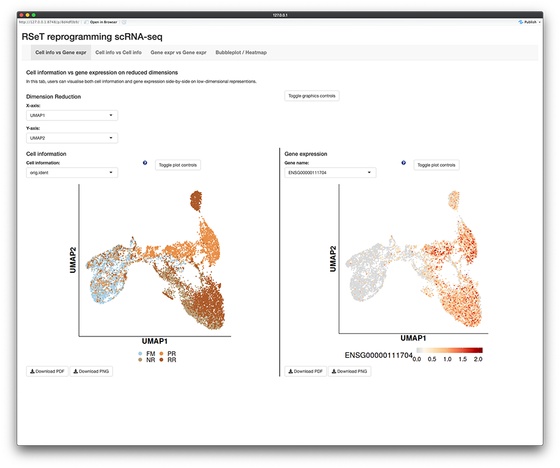

# ShinyCell package
`ShinyCell` is a R package that allows users to create interactive Shiny-based 
web applications to visualise single-cell data via (i) visualising cell 
information and/or gene expression on reduced dimensions e.g. UMAP, (ii) 
visualising the distribution of continuous cell information e.g. nUMI / module 
scores using violin plots / box plots and (iii) visualising the expression of 
multiple genes using bubbleplots / heatmap.

The package supports all of the major single-cell data formats (h5ad / loom / 
Seurat / SingleCellExperiment). It is easy to use and customise settings e.g. 
label names and colour palettes. Examples of ShinyCell-generated shiny apps 
for single and multi datasets can be found at http://shinycell1.ddnetbio.com 
and http://shinycell2.ddnetbio.com respectively.

This readme is broken down into the following sections:

- [Installation](#installation) on how to install `ShinyCell`

- [Quick Start Guide](#quick-start-guide) to rapidly deploy a shiny app with 
  a few lines of code

- [Frequently Asked Questions](#frequently-asked-questions)

There are also additional tutorials as follows:

- [Tutorial for changing ShinyCell aesthetics and other settings](
https://htmlpreview.github.io/?https://github.com/SGDDNB/ShinyCell/blob/master/docs/1aesthetics.html)

- [Tutorial for creating a ShinyCell app containing several single-cell datasets](
https://htmlpreview.github.io/?https://github.com/SGDDNB/ShinyCell/blob/master/docs/2multi.html)

- [Tutorial on other supported file formats (h5ad / loom / SCE)](
https://htmlpreview.github.io/?https://github.com/SGDDNB/ShinyCell/blob/master/docs/3otherformat.html)

- [Instructions on how to deploy ShinyCell apps online](
https://htmlpreview.github.io/?https://github.com/SGDDNB/ShinyCell/blob/master/docs/4cloud.html)


# Installation
First, users can run the following code to check if the packages required by 
`ShinyCell` exist and install them if required:
``` r
reqPkg = c("data.table", "Matrix", "hdf5r", "reticulate", "ggplot2", 
           "gridExtra", "glue", "readr", "RColorBrewer", "R.utils", "Seurat")
newPkg = reqPkg[!(reqPkg %in% installed.packages()[,"Package"])]
if(length(newPkg)){install.packages(newPkg)}

# If you are using h5ad file as input, run the code below as well
# reticulate::py_install("anndata")
```

Furthermore, on the system where the Shiny app will be deployed, users can run 
the following code to check if the packages required by the Shiny app exist 
and install them if required:
``` r
reqPkg = c("shiny", "shinyhelper", "data.table", "Matrix", "hdf5r", 
           "reticulate", "ggplot2", "gridExtra", "magrittr", "ggdendro")
newPkg = reqPkg[!(reqPkg %in% installed.packages()[,"Package"])]
if(length(newPkg)){install.packages(newPkg)}
```

`ShinyCell` can then be installed from GitHub as follows:
``` r
devtools::install_github("SGDDNB/ShinyCell")
```


# Quick Start Guide
In short, the `ShinyCell` package takes in an input single-cell object and 
generates a ShinyCell config `scConf` containing labelling and colour palette 
information for the single-cell metadata. The ShinyCell config and single-cell 
object are then used to generate the files and code required for the shiny app. 

In this example, we will use single-cell data (Seurat object) containing 
intermediates collected during the reprogramming of human fibroblast into 
induced pluripotent stem cells using the RSeT media condition, taken from 
[Liu, Ouyang, Rossello et al. Nature (2020)](
https://www.nature.com/articles/s41586-020-2734-6). The Seurat object can be 
[downloaded here](http://files.ddnetbio.com/hrpiFiles/readySeu_rset.rds).

A shiny app can then be quickly generated using the following code:
 
``` r
library(Seurat)
library(ShinyCell)

getExampleData()                       # Download example dataset (~200 MB)
seu = readRDS("readySeu_rset.rds")
scConf = createConfig(seu)
makeShinyApp(seu, scConf, gene.mapping = TRUE,
             shiny.title = "ShinyCell Quick Start") 
```

The generated shiny app can then be found in the `shinyApp/` folder (which is 
the default output folder). To run the app locally, use RStudio to open either 
`server.R` or `ui.R` in the shiny app folder and click on "Run App" in the top 
right corner. The shiny app can also be deployed online via online platforms 
e.g. [shinyapps.io](https://www.shinyapps.io/) or be hosted via Shiny Server.
The shiny app contains five tabs (highlighted in blue box), looking like this:



The first three tabs allows users to visualise single cells on reduced 
dimensions, either showing both cell information and gene expression (first 
tab), showing two cell information side-by-side (second tab) or showing two 
gene expressions side-by-side (third tab). The fourth tab allows users to 
visualise the distribution of continuous cell information e.g. nUMI / module 
scores using a violin plot or box plot and the fifth tab allows users to 
visualise the expression of multiple genes using a bubbleplot or heatmap.


# Frequently Asked Questions
- Q: How much memory / storage space does `ShinyCell` and the Shiny app consume?
  - A: The Shiny app itself consumes very little memory and is meant to be a 
       heavy-duty app where multiple users can access the app simultaneously. 
       Unlike typical R objects, the entire gene expression matrix is stored 
       on disk and *not on memory* via the hdf5 file system. Also, the hdf5 
       file system offers superior file compression and takes up less storage 
       space than native R file formats such as rds / Rdata files.
  - A: It should be noted that a large amount of memory is required when 
       *building* the Shiny app. This is because the whole Seurat / SCE object 
       has to be loaded onto memory and additional memory is required to 
       generate the required files. From experience, a typical laptop with 8GB 
       RAM can handle datasets around 30k cells while 16GB RAM machines can 
       handle around 60k-70k cells. 
       
- Q: I have generated additional dimension reductions (e.g. force-directed 
layout / MDS / monocle2 etc.) and would like to include them into the Shiny 
app. How do I do that?
  - A: `ShinyCell` automatically retrieves dimension reduction information from 
       the Seurat or SCE object. Thus, the additional dimension reductions 
       have to be added into the Seurat or SCE object before running `ShinyCell`. 
  - For Seurat objects, users can refer "Storing a custom dimensional reduction 
       calculation" in https://satijalab.org/seurat/v3.0/dim_reduction_vignette.html
  - For SCE objects, users can refer to https://bioconductor.org/packages/devel/bioc/vignettes/SingleCellExperiment/inst/doc/intro.html#3_Adding_low-dimensional_representations
  
- Q: I have both RNA and integrated data in my Seurat object. How do I specify 
which gene expression assay to plot in the Shiny app?
  - A: Only one gene expression assay can be visualised per dataset. To 
       specify the assay, use the `gex.assay = "integrated` argument in the 
       `makeShinyApp()` or `makeShinyFiles()` functions. If users want to 
       visualise both gene expression, they have to treat each assay as an 
       individual dataset and include multiple datasets into a single shiny 
       app, following the [Tutorial for creating a ShinyCell app containing several single-cell datasets](
https://htmlpreview.github.io/?https://github.com/SGDDNB/ShinyCell/blob/master/docs/2multi.html)


<br/><br/>
<br/><br/>
<br/><br/>
<br/><br/>
<br/><br/>