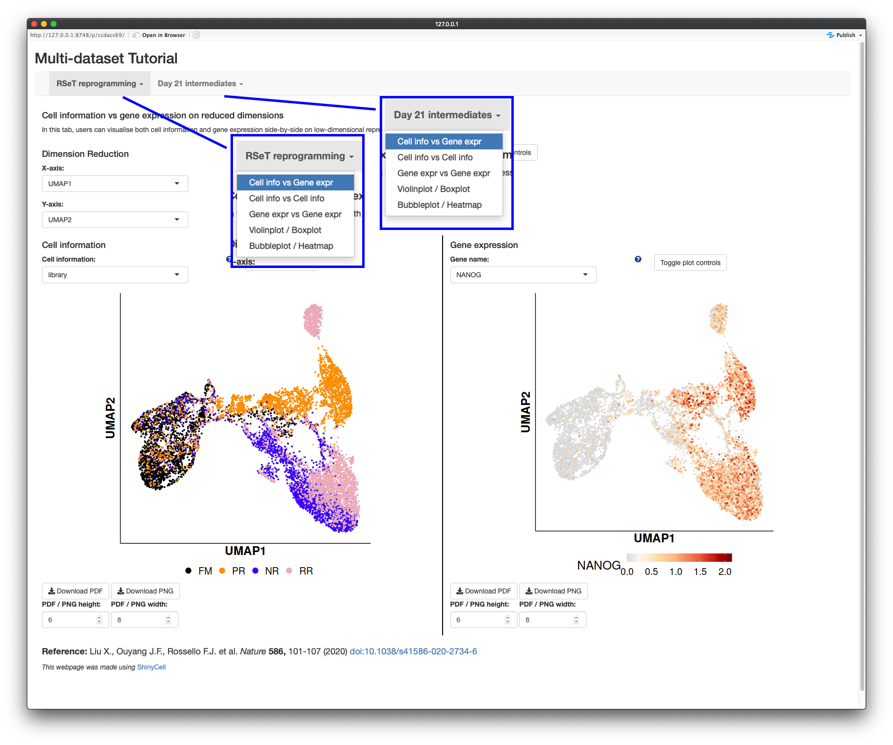

Users might want to include multiple single-cell datasets into a single Shiny 
app and `ShinyCell` provides this functionality. We will demonstrate how to 
create a shiny app containing two single-cell datasets. A live version of the 
shiny app generated here can be found at [shinycell2.ddnetbio.com](
http://shinycell2.ddnetbio.com).

To further change the aesthetics and ordering of metadata, please refer to the 
[Tutorial for changing ShinyCell aesthetics and other settings](
https://htmlpreview.github.io/?https://github.com/SGDDNB/ShinyCell/blob/master/docs/1aesthetics.html).


## Load data
For the first example dataset, we will use scRNA-seq data (Seurat object) 
containing intermediates collected during reprogramming of human fibroblast 
into induced pluripotent stem cells using the RSeT media condition, which can 
be [downloaded here](http://files.ddnetbio.com/hrpiFiles/readySeu_rset.rds). 
For the second example dataset, we will use scRNA-seq of day 21 reprogramming 
intermediates from the same publication, which can be 
[downloaded here](http://files.ddnetbio.com/hrpiFiles/readySeu_d21i.rds).
After downloading the data, we will begin by loading the required libraries. 

``` r
library(Seurat)
library(ShinyCell)
getExampleData("multi")      # Download multiple example datasets (~400 MB)
```


## Create ShinyCell configuration and configure settings for dataset 1
To create a multi-dataset Shiny app, we need to configure the settings for 
each dataset separately. We will do so for the first dataset as follows. A 
ShinyCell configuration `scConf1` is created, followed by modifying various 
aspects of the Shiny app e.g. removing excessive metadata, modifying the 
display names of metadata and modifying the colour palettes. For a more 
detailed explanation on how to customise the shiny app, refer to 
[Tutorial for customising ShinyCell aesthetics and other settings](
https://htmlpreview.github.io/?https://github.com/SGDDNB/ShinyCell/blob/master/docs/1aesthetics.html). 
We then run `makeShinyFiles()` to generate the files related to the first 
dataset. Notice that we specified `shiny.prefix = "sc1"` and this prefix is 
used to identify that the files containing single-cell data related to the 
first dataset. The remaining arguments are the same as explained in the 
[Tutorial for customising ShinyCell aesthetics and other settings](
https://htmlpreview.github.io/?https://github.com/SGDDNB/ShinyCell/blob/master/docs/1aesthetics.html).

``` r
seu <- readRDS("readySeu_rset.rds")
scConf1 = createConfig(seu)
scConf1 = delMeta(scConf1, c("orig.ident", "RNA_snn_res.0.5"))
scConf1 = modMetaName(scConf1, meta.to.mod = c("nUMI", "nGene", "pctMT", "pctHK"), 
                      new.name = c("No. UMIs", "No. detected genes",
                                   "% MT genes", "% HK genes"))
scConf1 = modColours(scConf1, meta.to.mod = "library", 
                     new.colours= c("black", "darkorange", "blue", "pink2"))
makeShinyFiles(seu, scConf1, gex.assay = "RNA", gex.slot = "data",
               gene.mapping = TRUE, shiny.prefix = "sc1",
               shiny.dir = "shinyAppMulti/",
               default.gene1 = "NANOG", default.gene2 = "DNMT3L",
               default.multigene = c("ANPEP","NANOG","ZIC2","NLGN4X","DNMT3L",
                                     "DPPA5","SLC7A2","GATA3","KRT19"),
               default.dimred = c("UMAP_1", "UMAP_2"))
```


## Create ShinyCell configuration and configure settings for dataset 2
We then repeat the same procedure for the second dataset to generate the files 
required for the Shiny app. Notice that we used a different prefix here 
`shiny.prefix = "sc2"`. 

``` r
seu <- readRDS("readySeu_d21i.rds")
scConf2 = createConfig(seu)
scConf2 = delMeta(scConf2, c("orig.ident", "RNA_snn_res.0.5"))
scConf2 = modMetaName(scConf2, meta.to.mod = c("nUMI", "nGene", "pctMT", "pctHK"), 
                      new.name = c("No. UMIs", "No. detected genes",
                                   "% MT genes", "% HK genes"))
scConf2 = modColours(scConf2, meta.to.mod = "library", 
                     new.colours= c("black", "blue", "purple"))
makeShinyFiles(seu, scConf2, gex.assay = "RNA", gex.slot = "data",
               gene.mapping = TRUE, shiny.prefix = "sc2",
               shiny.dir = "shinyAppMulti/",
               default.gene1 = "GATA3", default.gene2 = "DNMT3L",
               default.multigene = c("ANPEP","NANOG","ZIC2","NLGN4X","DNMT3L",
                                     "DPPA5","SLC7A2","GATA3","KRT19"),
               default.dimred = c("UMAP_1", "UMAP_2"))
```


## Generate code for Shiny app
We can the proceed to the final part where we generate the code for the Shiny 
app using the `makeShinyCodesMulti()` function. To specify that two datasets 
will be included in this Shiny app, we input the prefixes of the two datasets 
`shiny.prefix = c("sc1", "sc2")`. Also, users need to specify section headers 
for each dataset via the `shiny.headers` argument. The remaining arguments are 
the same as explained in the 
[Tutorial for changing ShinyCell aesthetics and other settings](
https://htmlpreview.github.io/?https://github.com/SGDDNB/ShinyCell/blob/master/docs/1aesthetics.html).

``` r
citation = list(
  author  = "Liu X., Ouyang J.F., Rossello F.J. et al.",
  title   = "",
  journal = "Nature",
  volume  = "586",
  page    = "101-107",
  year    = "2020", 
  doi     = "10.1038/s41586-020-2734-6",
  link    = "https://www.nature.com/articles/s41586-020-2734-6")
makeShinyCodesMulti(
  shiny.title = "Multi-dataset Tutorial", shiny.footnotes = citation,
  shiny.prefix = c("sc1", "sc2"),
  shiny.headers = c("RSeT reprogramming", "Day 21 intermediates"), 
  shiny.dir = "shinyAppMulti/") 
```

Now, we have both the data and code for the Shiny app and we can run the Shiny 
app. Each dataset can be found in their corresponding tabs and clicking on the 
tab creates a dropdown to change the type of plot to display on the Shiny app.
This tutorial can be easily expanded to include three or more datasets. Users 
simply have to create the corresponding data files for each dataset and finally 
generate the code for the Shiny app. 
A live version of the shiny app can be found at 
[shinycell2.ddnetbio.com](http://shinycell2.ddnetbio.com).



