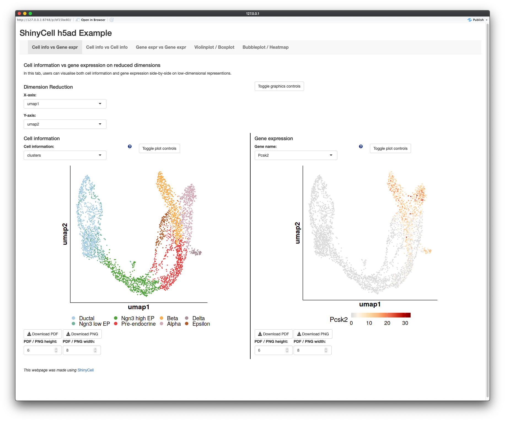
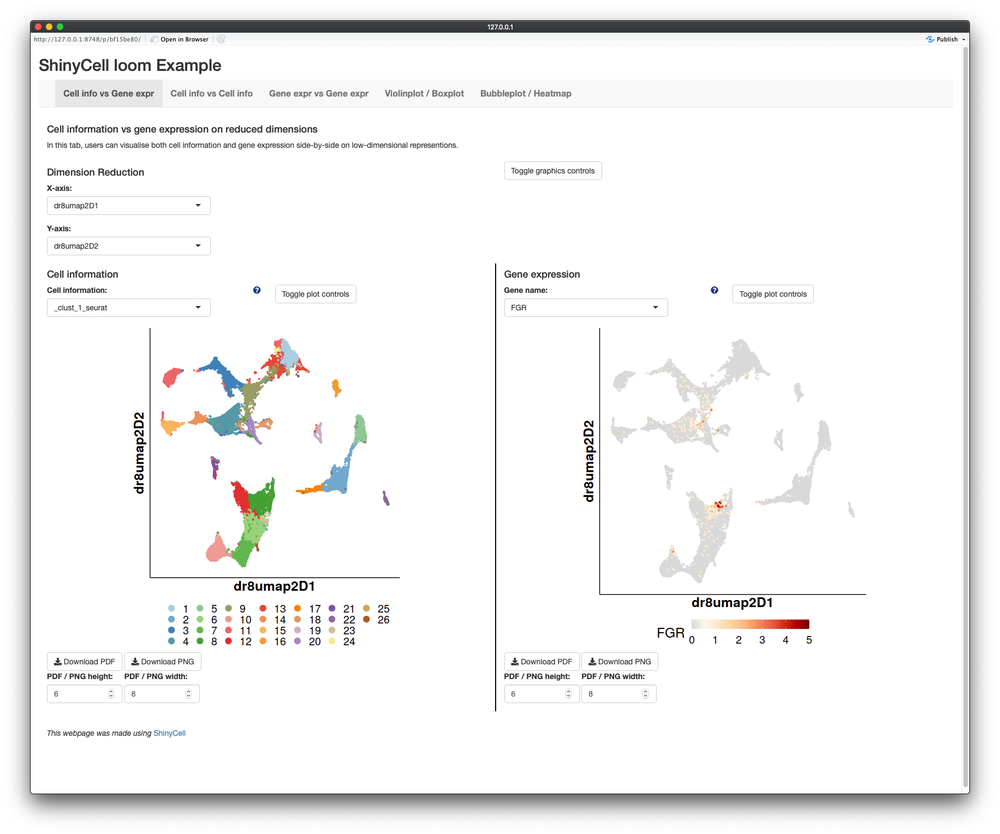

ShinyCell supports all four common single-cell data formats, namely h5ad, 
loom, SCE and Seurat. In our other tutorials, we focused on using Seurat 
objects as inputs. Here, we will explain how to use the other supported file 
formats to create shiny apps from single-cell data objects.

Overall, the process is identical to the other tutorials except that the file 
path is required for h5ad / loom files and the SCE object itself is supplied 
for SingleCellExperiment objects. To further change the aesthetics and 
ordering of metadata, please refer to the 
[Tutorial for changing ShinyCell aesthetics and other settings](
https://htmlpreview.github.io/?https://github.com/SGDDNB/ShinyCell/blob/master/docs/1aesthetics.html).
To include multiple datasets into one shiny app, please refer to the 
[Tutorial for creating a ShinyCell app containing several single-cell datasets](
https://htmlpreview.github.io/?https://github.com/SGDDNB/ShinyCell/blob/master/docs/2multi.html).


## h5ad file as input
For using h5ad file as input, we will demonstrate using the scRNA-seq of 
endocrine development in the pancreas, taken from 
[Bastidas-Ponce et al. Development (2018)](
https://dev.biologists.org/content/146/12/dev173849.abstract). The dataset has 
been further processed for use with the [scVelo package](
https://scvelo.readthedocs.io/Pancreas.html).

``` r
library(ShinyCell)
getExampleData("h5ad")

inpFile = "endocrinogenesis_day15.h5ad"
scConf = createConfig(inpFile)
makeShinyApp(inpFile, scConf, 
             default.gene1 = "Pcsk2", default.gene2 = "Dcdc2a",
             default.multigene = c("Pcsk2", "Dcdc2a", "Ank", "Gng12", "Top2a",
                                   "Pak3", "Tmem163", "Nfib", "Pim2", "Smoc1"),
             shiny.dir = "shinyAppH5ad/", 
             shiny.title = "ShinyCell h5ad Example") 
```

Running the above code generates a shiny app in the `shinyAppH5ad/` folder,
looking like this:




## loom file as input
For using loom file as input, we will demonstrate using the scRNA-seq of 
hematopoietic differentiation, taken from 
[Setty et al. Nature Biotechnology (2019)](
https://www.nature.com/articles/s41587-019-0068-4). The dataset has 
been further processed using the [ASAP pipeline; key: xr7ne3](
https://asap.epfl.ch/).

``` r
library(ShinyCell)
getExampleData("loom")

inpFile <- "xr7ne3_dim_reduction_13225_output.loom"
scConf = createConfig(inpFile, meta.to.include = 
                        c("_Depth","_Detected_Genes","_Mitochondrial_Content",
                          "_Protein_Coding_Content","_Ribosomal_Content",
                          "_clust_1_seurat","bundle_version","donor_organism.sex"))

# Manually factor "_clust_1_seurat" column
scConf[ID == "_clust_1_seurat"]$fID = paste(seq(26), collapse = "|")
scConf[ID == "_clust_1_seurat"]$fUI = paste(seq(26), collapse = "|")
scConf[ID == "_clust_1_seurat"]$fCL = 
  paste0(colorRampPalette(brewer.pal(12, "Paired"))(26), collapse = "|")
scConf[ID == "_clust_1_seurat"]$fRow = 4
scConf = modDefault(scConf, "_clust_1_seurat", "bundle_version")

makeShinyApp(inpFile, scConf, 
             shiny.dir = "shinyAppLoom/", 
             shiny.title = "ShinyCell loom Example") 
```

Note that loom files do not necessarily store the categories / levels 
information for discrete single-cell metadata. ShinyCell tries to circumvent 
this by automatically factoring all columns containing text. However, there 
are cases where the single-cell metadata are integers and it is difficult to 
automatically detect if these metadata are meant to be treated in a discrete 
or continuous manner. In this loom file, the seurat clusters `_clust_1_seurat` 
is one such example and the categories / levels information have to be 
manually added into the ShinyCell configuration. 

Running the above code generates a shiny app in the `shinyAppLoom/` folder,
looking like this:




## SCE object as input
For using SCE object as input, we will demonstrate using the Seurat object 
used in the other tutorials. The Seurat object can be easily converted to a 
SCE object and the SCE object is processed by ShinyCell in the same way as its 
Seurat counterpart. Here, we reuse the code from the quick start guide. 

``` r
library(Seurat)
library(ShinyCell)

getExampleData()                       # Download example dataset (~200 MB)
seu = readRDS("readySeu_rset.rds")
sce = as.SingleCellExperiment(seu)
scConf = createConfig(sce)
makeShinyApp(sce, scConf, gene.mapping = TRUE,
             shiny.title = "ShinyCell Quick Start") 
```

