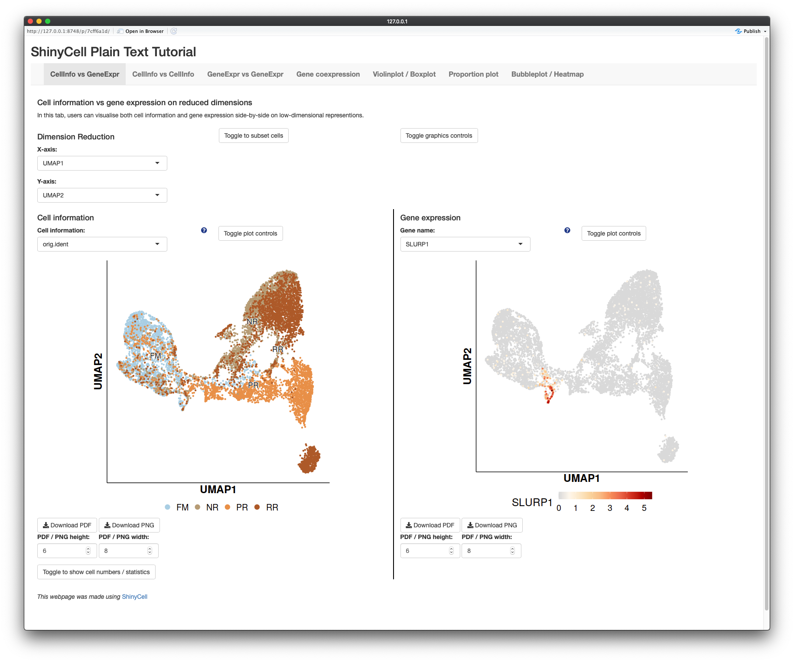

## Introduction
Apart from major single-cell data formats (h5ad / loom / Seurat / SCE), users 
may start with a plain-text gene expression matrix or output from the 10X 
cellranger pipeline. Here, we provide a simple tutorial on performing some 
basic single-cell analysis using the Seurat pipeline and creating a ShinyCell 
app using the generated Seurat object.

WARNING: We would like to emphasize that ShinyCell is a visualisation tool and 
_not an automated analysis tool_. So while we provide some code to perform 
basic single-cell analysis, it is up to the user to ensure that the Seurat 
analysis makes sense and agree with their own biological understanding.


## Code
The code comprises several parts. First, after loading the required packages, 
we will read in the plain-text gene expression matrix and convert it into a 
sparse matrix format. For cellranger outputs, one can run the `Read10X()` 
instead to read in the gene expression from the cellranger output directory. 
Second, we will perform some basic single-cell analysis using the Seurat 
pipeline. The analysis include preprocessing the data, followed by PCA and 
UMAP dimension reduction and then unsupervised clustering. Third, we will 
create a ShinyCell app using the generated Seurat object. The code is 
essentially the same as that in the quick start guide.

``` r
library(data.table)
library(Matrix)
library(Seurat)
library(ShinyCell)


## 1. Read in gene expression
getExampleData("plaintext")  # Download plain text example dataset
inpGEX = fread("test/rset.txt.gz")
inpGEX = as.matrix(inpGEX[, -1], rownames = inpGEX$V1)
inpGEX = as(inpGEX, "dgCMatrix")
# inpGEX = Read10X(data.dir = cellranger/output/directory/)


## 2. Seurat pipeline
seu = CreateSeuratObject(counts = inpGEX)
seu = NormalizeData(seu)
seu = FindVariableFeatures(seu, nfeatures = 1500)
seu = ScaleData(seu)

seu = RunPCA(seu, npcs = 30)
seu = RunUMAP(seu, dims = 1:15)
seu = FindNeighbors(seu, dims = 1:15)
seu = FindClusters(seu, resolution = 0.5, random.seed = 42)

## 3. ShinyCell
scConf = createConfig(seu)
makeShinyApp(seu, scConf, gene.mapping = TRUE, 
             shiny.dir = "shinyAppPlain",
             shiny.title = "ShinyCell Plain Text Tutorial") 


```

Running the above code generates a shiny app in the `shinyAppPlain/` folder,
looking like this:



